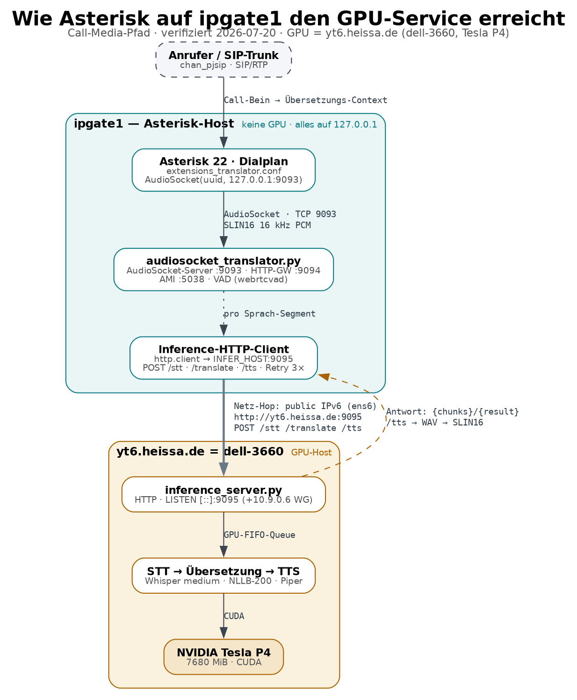

# Inference-Server API — `yt6.heissa.de:9095` (dell-3660, Tesla P4)

GPU-Inferenzdienst hinter der Live-Übersetzung: **Whisper medium (STT)**, **NLLB-200-distilled-600M (Übersetzung)**, **Piper (TTS)**. Implementiert in `inference_server.py` (asyncio-Rohsocket-HTTP, kein Framework).



*(Diagramm-Quelle: [`gpu_access.dot`](gpu_access.dot) · auch als [PDF](gpu_access.pdf) / [SVG](gpu_access.svg). Vollständige API auch als OpenAPI-Spec: [`openapi.yaml`](openapi.yaml).)*

> ⚠️ **Sicherheitslage (Stand 2026-07-20):** Der Dienst lauscht faktisch auf `[::]:9095` und ist über öffentliches IPv6 **ohne Authentifizierung** erreichbar (verifiziert von ipgate1 **und** einem netzfremden Rechner). Der Docstring sagt „localhost only", die laufende Instanz ist es nicht. Alles unten ist damit **für jeden mit IPv6 nutzbar**.

---

## Konventionen

| Punkt | Verhalten |
|---|---|
| Transport | **HTTP/1.1, unverschlüsselt** (kein TLS) |
| Auth | **keine** — kein Token, kein API-Key, keine Host-Prüfung |
| Methode | **wird nicht geprüft** — Docstring sagt `POST`, faktisch zählt nur der Pfad + Body |
| Routing | `path.startswith("/stt" | "/translate" | "/tts" | "/nlu")` → sonst `404`. Loose: `/stt-egal` matcht auch |
| Body | via `Content-Length` gelesen; Header-Limit **64 KB**; Body-Read-Timeout 30 s/Chunk; **keine Body-Größenobergrenze** für `/stt` |
| GPU-Scheduling | **eine globale FIFO-Queue** — alle Jobs (jeder Aufrufer) werden serialisiert abgearbeitet |
| Fehlercodes | `200` ok · `400` Bad Request · `404` unbekannter Pfad · `500` intern |

---

## 1) `POST /stt` — Speech-to-Text

Transkribiert rohe Audio-Samples.

- **Query:** `lang` (ISO-639-1, Default `de`) → Whisper-Sprachhinweis
- **Body:** roher **SLIN16 PCM**, 16 kHz, mono, 16-bit little-endian (kein WAV-Header)
- **Antwort:** `{"chunks": ["Satz 1", "Satz 2", …]}` (satzweise gesplittet)
- Modell: Whisper *medium*, int8/CUDA, beam 2, VAD-Filter

```bash
curl -s --data-binary @audio.raw \
  "http://yt6.heissa.de:9095/stt?lang=de"
# → {"chunks":["Hallo, wie geht es dir?"]}
```

## 2) `POST /translate` — Übersetzung

- **Body (JSON):** `{"text": "...", "from": "de", "to": "it"}` (Defaults `from=de`, `to=it`)
- **Antwort:** `{"result": "..."}`
- `from`/`to`: 2-Letter-Code aus der Sprachtabelle; Unbekanntes → Fallback `deu_Latn`/`eng_Latn`. `from==to` gibt den Text unverändert zurück.
- Modell: NLLB-200-distilled-600M, satzweise, `max_new_tokens=256`/Satz

```bash
curl -s -H 'Content-Type: application/json' \
  -d '{"text":"Guten Morgen","from":"de","to":"ru"}' \
  http://yt6.heissa.de:9095/translate
# → {"result":"Доброе утро"}
```

## 3) `POST /tts` — Text-to-Speech

- **Body (JSON):** `{"text": "...", "lang": "it"}` (Default `lang=it`)
- **Antwort:** `audio/wav` — **16 kHz, mono, 16-bit PCM WAV**
- Unbekannte `lang` → **deutsche Stimme** als Fallback
- Modell: Piper (je Sprache eine Stimme, s. Tabelle)

```bash
curl -s -H 'Content-Type: application/json' \
  -d '{"text":"Buongiorno","lang":"it"}' \
  http://yt6.heissa.de:9095/tts -o out.wav
```

## 4) `POST /nlu` — Rufnummer + Sprache aus einer Audiodatei

Dachte für den internen Ansage-Flow (Anrufer nennt Zielnummer + Sprache). **Nimmt einen serverseitigen Dateipfad.**

- **Body (JSON):** `{"path": "/abs/pfad/zu.wav", "lang": "de"}`
- **Antwort:** `{"text": "...", "number": "+49...", "suffix": "39"}`
- Ablauf: `os.path.exists(path)` → Datei per libsndfile lesen (jedes von `soundfile` unterstützte Format, wird auf 16 kHz gemischt) → Whisper (Auto-Spracherkennung) → Nummer/Sprache aus dem Text extrahieren.
- **Nebenwirkung:** bei **nicht-leerer** Transkription wird die Datei mit `os.unlink(path)` **gelöscht**.

```bash
curl -s -H 'Content-Type: application/json' \
  -d '{"path":"/tmp/prompt.wav","lang":"de"}' \
  http://yt6.heissa.de:9095/nlu
# → {"text":"plus neununddreißig ...","number":"+39...","suffix":"39"}
```

---

## Unterstützte Sprachen

**Übersetzung (NLLB) & TTS (Piper), 16 Sprachen:**
`de, en, fr, it, ru, es, el, pl, pt, uk, kk, zh, tr, hi, fa, ka`
STT (Whisper) akzeptiert darüber hinaus jeden von Whisper unterstützten `lang`-Wert.

---

## Was ist darüber theoretisch alles möglich?

### Legitime Fähigkeiten (die die Live-Übersetzung nutzt)
1. **STT** — beliebiges 16-kHz-PCM zu Text (satzweise), sprachgehinweist.
2. **Übersetzung** — Text zwischen 16 Sprachen (beliebige Richtung).
3. **TTS** — Text zu 16-kHz-WAV in 16 Stimmen.
4. **NLU** — aus einer Audiodatei Zielrufnummer (E.164) + Länder-/Sprach-Suffix ableiten.

### Missbrauchs-/Angriffsfläche (weil offen & ohne Auth)
Ein Fremder mit IPv6 kann **ohne jede Hürde**:

- **Gratis-GPU als Dienst** — die Tesla P4 als kostenlose ASR/Übersetzungs-/TTS-Maschine zweckentfremden (`/stt`, `/translate`, `/tts`). Keine Rate-Limits.
- **DoS gegen laufende Telefonate** — alle GPU-Jobs laufen durch **eine FIFO-Queue**. Ein paar parallele oder große Requests stauen die Queue → die latenzkritische Live-Übersetzung echter Calls bricht/verzögert. Kein Auth, kein Limit → trivial auslösbar.
- **Rechen-Amplifikation** — großer `/stt`-Body (keine Größenobergrenze) oder langer `/translate`-Text erzwingt lange GPU-Jobs.
- **`/nlu` = Datei-Primitive auf dell** (Prozess-User `gh`):
  - **Existenz-Orakel**: `path not found` (400) vs. anderer Fehler/Erfolg verrät, ob ein Pfad existiert.
  - **Inhalts-Exfiltration von Audiodateien**: jede von libsndfile lesbare Audiodatei (WAV/FLAC/OGG…) wird **transkribiert und der Text zurückgegeben** — z. B. mitgeschnittene Anrufe/Voicemails auf dem Host abgreifbar.
  - **Löschen von Dateien**: liefert die Transkription nicht-leeren Text, wird die Datei per `os.unlink` **entfernt** — ein destruktives Primitiv für alle audio-dekodierbaren, von `gh` löschbaren Dateien.
- **Kein TLS** — Inhalte (Gesprächstexte, Übersetzungen) laufen im Klartext übers Netz.

### Grenzen / was **nicht** geht
- Keine `os`-/Shell-Ausführung, kein Schreiben beliebiger Pfade über die API (nur `/nlu`-Löschen + intern generierte NLU-Prompts nach `SOUNDS_CUSTOM`).
- `/nlu` liest nur, was `soundfile` als Audio dekodiert — kein genereller Datei-Download-Kanal für Nicht-Audio (die werfen 500, ohne Inhalt).
- Öffentlich nur über **IPv6** erreichbar (kein öffentlicher IPv4-Listener; IPv4 nur via WireGuard `10.9.0.6`).

---

## Empfehlung (Absicherung)
Bind an `::1` + `10.9.0.6` statt `[::]`, ipgate1 `.env` auf `INFER_HOST=10.9.0.6` (WireGuard) umstellen — dann läuft die Inferenz verschlüsselt übers VPN und Port 9095 ist nicht mehr öffentlich. Alternativ Firewall: `9095` nur aus `10.9.0.0/24` + localhost. `/nlu` zusätzlich auf ein Whitelist-Verzeichnis einschränken.
