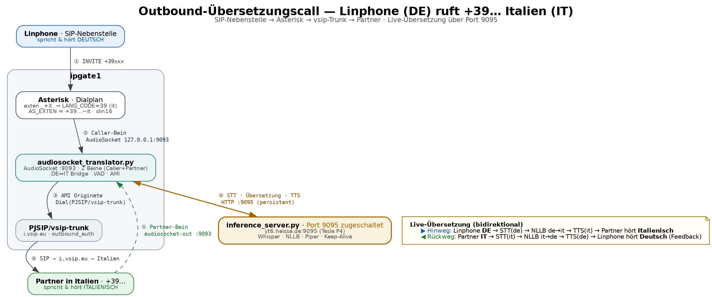

# Outbound-Übersetzungscall: Linphone (DE) → +39 Italien

Eine SIP-Nebenstelle (Linphone, Deutsch) ruft eine italienische Nummer `+39…`.
Asterisk auf **ipgate1** geht über den **vsip-Trunk** raus, schaltet den
GPU-Inference-Dienst auf **Port 9095** zu und übersetzt live in beide Richtungen:
der Partner hört **Italienisch**, das Linphone bekommt **deutsches Feedback**.

*(Quelle: [`outbound_it.dot`](outbound_it.dot) · auch als [PDF](outbound_it.pdf) / [SVG](outbound_it.svg). Gesamtarchitektur: [`gpu_access.png`](gpu_access.png), API: [`API.md`](API.md).)*

## Ablauf

1. **Linphone** wählt `+39xxx` → SIP **INVITE** an Asterisk.
2. **Asterisk-Dialplan** (`exten => _+X.`): setzt `LANG_CODE` (39 → `it`),
   `AS_EXTEN = ${EXTEN}~it`, Kanalformat `slin16`.
3. **Caller-Bein** in den Translator via `AudioSocket(${UUID}, 127.0.0.1:9093)`.
4. Der **Translator** (`audiosocket_translator.py`) originiert per **AMI** das
   zweite Bein: `Dial(PJSIP/vsip-trunk)` → über `i.vsip.eu` nach Italien.
5. **Partner-Bein** kommt via Kontext `[audiosocket-out]` ebenfalls über
   `AudioSocket … :9093` in den Translator; er bridged beide Beine.
6. Für jedes Sprach-Segment ruft der Translator den **Inference-Server**
   `yt6.heissa.de:9095` (Tesla P4, HTTP mit Keep-Alive) auf.

## Übersetzungsrichtungen

| Richtung | Kette | Ergebnis |
|---|---|---|
| **Hinweg** | Linphone **DE** → `STT(de)` → `NLLB de→it` → `TTS(it)` | Partner hört **Italienisch** |
| **Rückweg** | Partner **IT** → `STT(it)` → `NLLB it→de` → `TTS(de)` | Linphone hört **Deutsch** (Feedback) |
